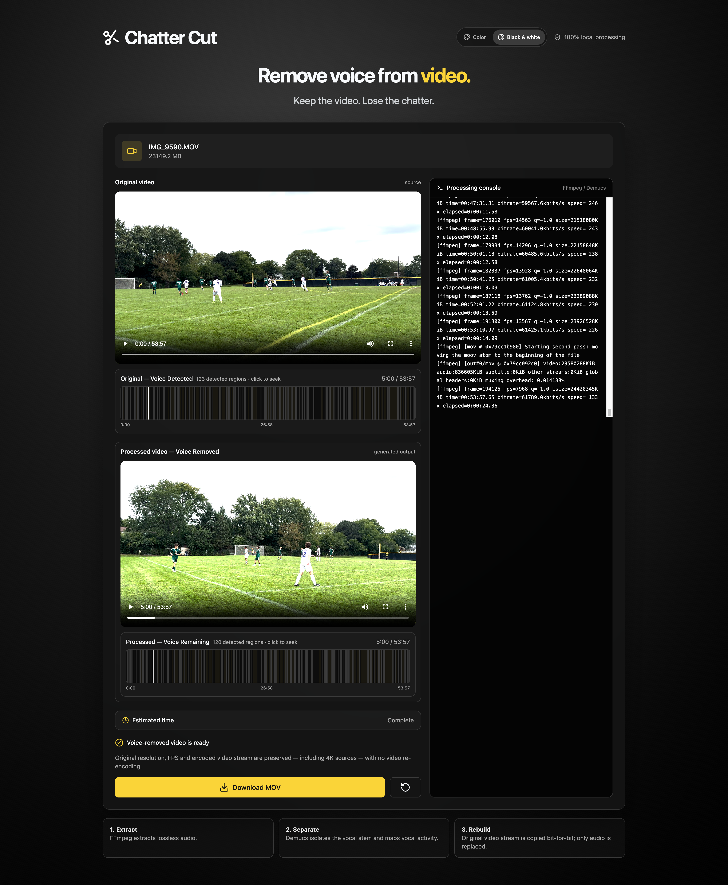

# Chatter Cut

### Keep the video. Lose the chatter.



Remove voices from videos locally on your Mac while preserving the original video stream.

## Privacy

**100% local processing.** Your video and audio stay on your Mac. The app does not upload media to a cloud processing service.

Internet access is only needed during installation/update and when the Demucs model must be downloaded.

## Vibe Coded

So don't expect quality code here.

## Installation — macOS

Open Terminal in this project folder and run:

```bash
./setup.sh && ./start.sh
```

**That's it.** The first command installs and verifies everything. If setup succeeds, the second command immediately starts Local Voice Remover.

`setup.sh` automatically handles:

- Apple Command Line Tools check
- Homebrew installation if needed
- nvm
- the project's tested Node.js version
- the project's pinned pnpm version
- FFmpeg and ffprobe
- uv
- the project's pinned Python runtime
- the repository-local Python environment
- NumPy
- PyTorch
- Demucs
- JavaScript dependencies
- final environment verification

You do **not** need to install Demucs globally, activate Python manually, run `pnpm setup`, or configure Node by hand.

If macOS says the scripts are not executable after downloading/unzipping:

```bash
chmod +x setup.sh start.sh
./setup.sh && ./start.sh
```

## Starting the app from then on

The full setup only needs to be run the first time.

After that, whenever you want to use Local Voice Remover, open Terminal in the project folder and run:

```bash
./start.sh
```

`start.sh` loads the project's Node environment, verifies the local processing stack, and starts both the UI and local API.

Open the local URL shown in Terminal, normally:

```text
http://localhost:5173
```

If that port is occupied, Vite may use the next available port.

## Repair or update the installation

Run the installer again:

```bash
./setup.sh
```

The setup script is designed to be rerun. It repairs/checks the local toolchain and dependencies, then runs the environment verification.

After it completes:

```bash
./start.sh
```

## Processing modes

### Foreground / closest voices

Uses the **Foreground Voice Range** control to remove the more prominent portion of the separated vocal signal while retaining quieter vocal material where possible.

The slider starts at **60%**, the suggested starting point for voices that are very loud or close to the camera. Adjust up if the voice you want to remove remains, or down if voices you want to keep are being removed.

The control estimates **voice prominence**, not literal physical distance from the camera. A single mixed microphone recording cannot reliably determine that a speaker is a specific number of feet away.

### Remove all voices

Uses the full Demucs `no_vocals` stem to remove detected vocal content as aggressively as possible.

## Video quality

The video stream is copied instead of re-encoded where the output container supports it. This preserves the source video codec, resolution, frame rate, HDR/color information, and encoded video quality.

Audio is processed separately.

For MOV input, the app keeps MOV output and uses lossless PCM audio. Other supported containers use an appropriate audio codec for that container.

## Saved videos and temporary files

Videos, uploaded source copies, and processing files are stored in the current user's Downloads folder. Finished videos are saved automatically to:

```text
~/Downloads/chatter-cut/processed-videos/
```

The app resolves your own home directory and creates this folder if needed; no username is hardcoded. Finished videos keep the source name with a job ID prefix and a `-no-voice` suffix. The **Download** button is also available in the app; your browser controls where that additional copy is saved.

Videos created before this change remain in `.local-voice-remover/outputs/`, and their existing playback and download links continue to work. New finished videos are saved to `~/Downloads/chatter-cut/processed-videos/`.

Restart the app after updating so the server uses the new save location.

## Large videos and disk space

Large videos can require substantial temporary disk space because the app creates uncompressed audio and AI separation files.

Before AI separation, the app estimates the required working space and checks available disk space for both temporary files and the finished video.

Uploaded source copies and temporary audio/AI processing files are stored in subfolders of the same Downloads folder:

```text
~/Downloads/chatter-cut/uploads/
~/Downloads/chatter-cut/work/
```

Uploaded source copies are deleted when their job finishes. Processing files remain in `work/`. New jobs do not create files in `.local-voice-remover/` inside the project.

If you run out of disk space, delete finished videos you no longer need from `~/Downloads/chatter-cut/processed-videos/`. The app does not automatically delete them. You can also delete temporary files in `~/Downloads/chatter-cut/work/` when no videos are being processed.

## Environment check

Normally you do not need to run this manually because `setup.sh` and `start.sh` handle it.

For troubleshooting:

```bash
pnpm doctor
```

It checks:

```text
Node
pnpm
FFmpeg
ffprobe
uv
Python
NumPy
PyTorch
Demucs
```

The server uses the repository-owned AI environment through:

```bash
uv run demucs
```

It does **not** use an arbitrary globally installed Demucs.

## Why versions are controlled

AI/audio applications are more reliable when the complete toolchain is tested together.

This project therefore controls its runtime instead of automatically using whatever happens to be newest on the Mac:

- `.nvmrc` controls the Node major version.
- `package.json` controls pnpm compatibility.
- `.python-version` controls Python.
- `pyproject.toml` controls the Python AI dependencies.
- `pnpm-lock.yaml` controls JavaScript dependency resolution when present.
- `uv.lock` controls Python dependency resolution when present.

This avoids a system Python, global Demucs installation, or unrelated package update silently changing the processing environment.

## Troubleshooting

### Setup stopped while installing Apple Command Line Tools

Complete Apple's installer and then run:

```bash
./setup.sh
```

again.

### Environment check fails

Run:

```bash
./setup.sh
```

Do not start by globally reinstalling Demucs or PyTorch.

### Demucs/PyTorch is broken

Repair the project-owned Python environment:

```bash
rm -rf .venv
./setup.sh
```

### Scripts are not executable

```bash
chmod +x setup.sh start.sh
```

Then:

```bash
./setup.sh
```

### Complete manual diagnostics

```bash
node -v
pnpm -v
ffmpeg -version
ffprobe -version
uv --version
uv run python --version
uv run python -c 'import numpy, torch, demucs; print("AI imports OK")'
uv run demucs --help
pnpm doctor
```

## Everyday workflow

First time:

```bash
./setup.sh && ./start.sh
```

Every time after that:

```bash
./start.sh
```
